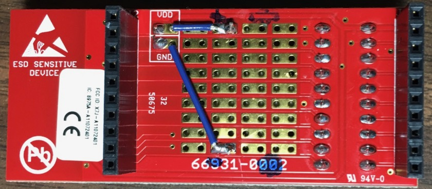

MSP430 Temperature Sensor
==============================

This project is a coin cell-powered wireless temperature sensor with with a
430BOOST-CC110L BoosterPack.

Since it is a wireless sensor, it depends on a receiver hub to process and
store the data. See [Wireless Sensor Receiver Hub](https://gitlab.com/Andy4495/Sensor-Receiver)
for an implementation of a receiver hub.

My particular design makes use of the prototyping area available on the CC110L
BoosterPack to make a compact wireless sensor with a standalone MSP430G2553
PDIP IC (see photo below). However, since the sketch uses the [MspTandV library](https://gitlab.com/Andy4495/mspTandV), it can be compiled for any MSP430 variant
supported by the library.

Because the processor spends most of its time sleeping, and the only external
component is the low-power CC110L BoosterPack, the temperature sensor can
last for several months using a single 3 V lithium coin battery.

If using this sketch on a standard LaunchPad, be sure to remove the jumpers
connecting the processor to the emulation section of the LaunchPad in order
to minimize power consumption.

## Program details ##

The sketch collects the following data:

- MSP430
     - Die temperature in degrees Fahrenheit * 10
         - For example, 733 represents 73.3 degrees F
     - Battery voltage (Vcc) in millivolts
         - For example, 2977 represents 2.977 volts
     - Number of times "loop()" has run since the last reboot
     - Current "millis()" value at the time of transmission

After collecting the sensor data, the data is packaged and transmitted to a
receiver hub which can then further process and store the data over time.

## External Libraries ##

[Calibrated Temperature and Vcc Library](https://gitlab.com/Andy4495/mspTandV)

* Used for the internal MSP430 temperature and battery voltage measurements.

## References ##

* [CC110L BoosterPack](http://www.ti.com/tool/430BOOST-CC110L)
* [Wireless Sensor Receiver Hub](https://gitlab.com/Andy4495/Sensor-Receiver)

## Integrated MSP430G2553 and Coin Cell Battery on CC110L BoosterPack ##

- 
- 
